 # ぽけっとがいど
 ２年後期制作のWebアプリ 
 ３人でのグループ開発

## 成果
 **第7回専門学校HTML5アワード　グランプリ賞** 
コンテストサイト：https://html5award.com/award2023

 **校内の産学連携プロジェクト　1位**

## 概要
旅行の道中を楽しむためのアプリ 
周辺の観光スポットの情報を自動で取得し、子どもにもわかる言葉に要約後、読み上げを行う

youtubeリンク(操作動画)：https://youtu.be/bbNiJO8J8Q0?si=iRPlruhfoIqlK8_S

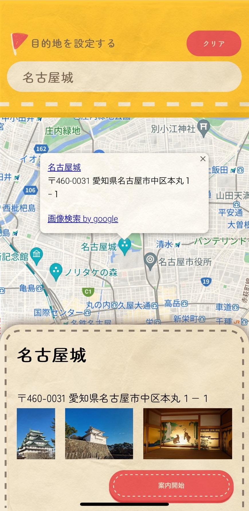
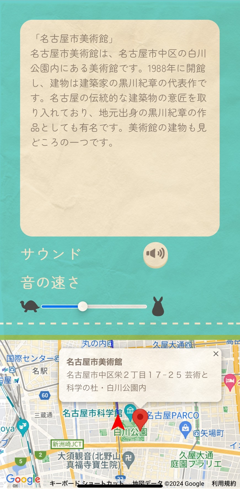

## 使用したもの
使用言語：JavaScript,HTML,CSS 
使用技術：ChatGPT,GoogleMapsAPI,Media Wiki,Firebase,Text-to-Speech,FirebaseHosting

## 仕組み（発表資料）
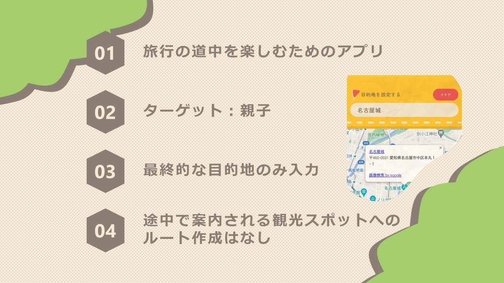
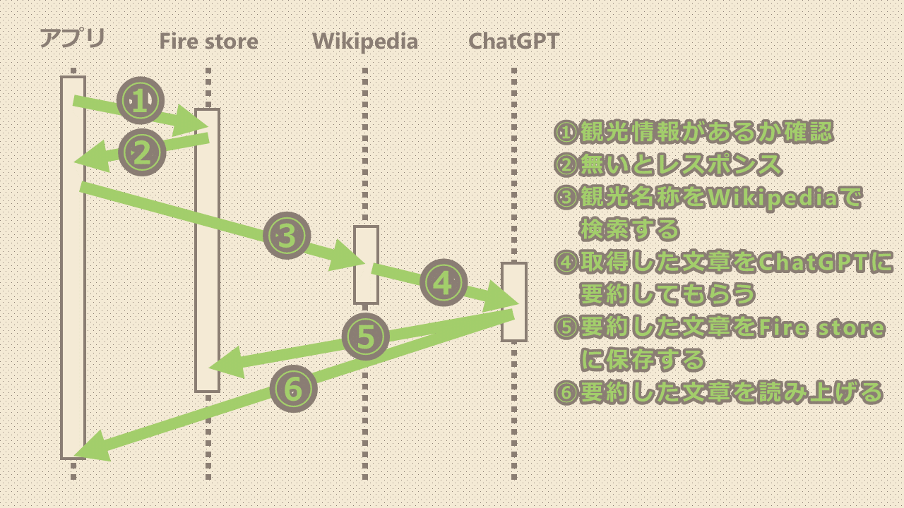
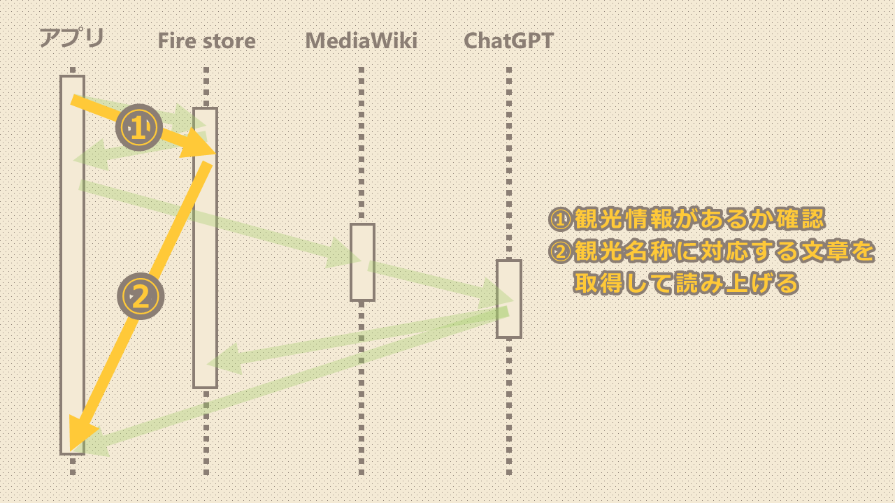
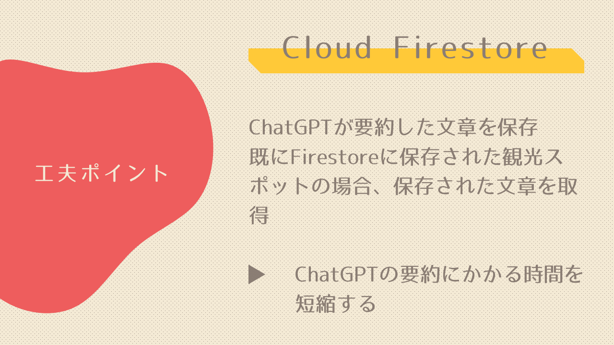
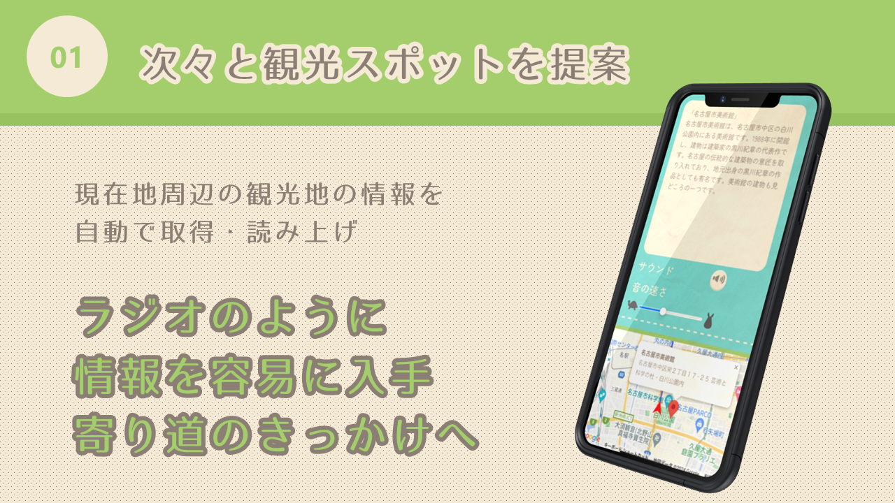
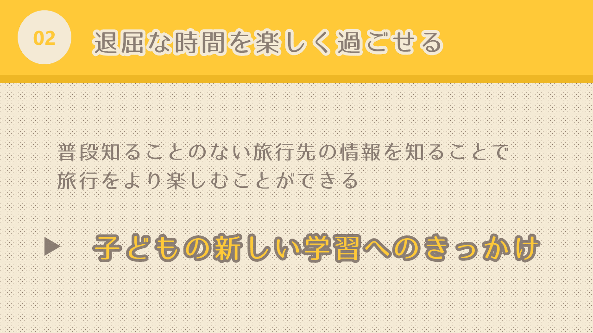
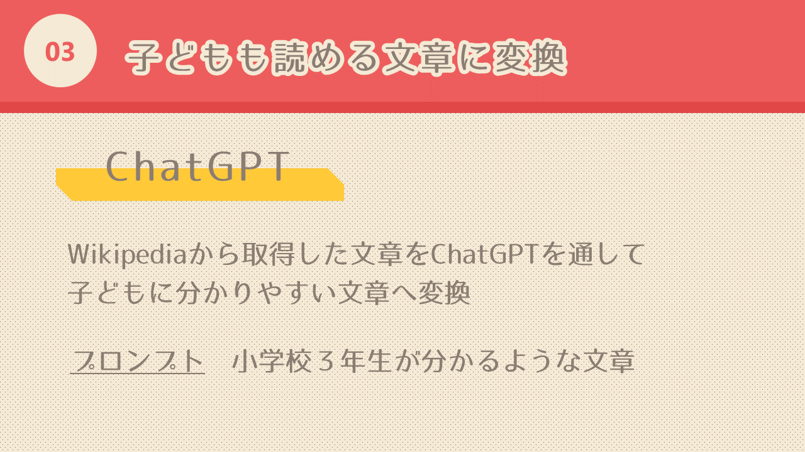
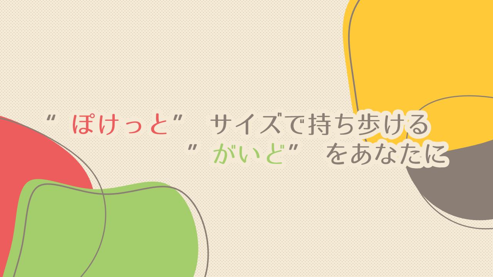
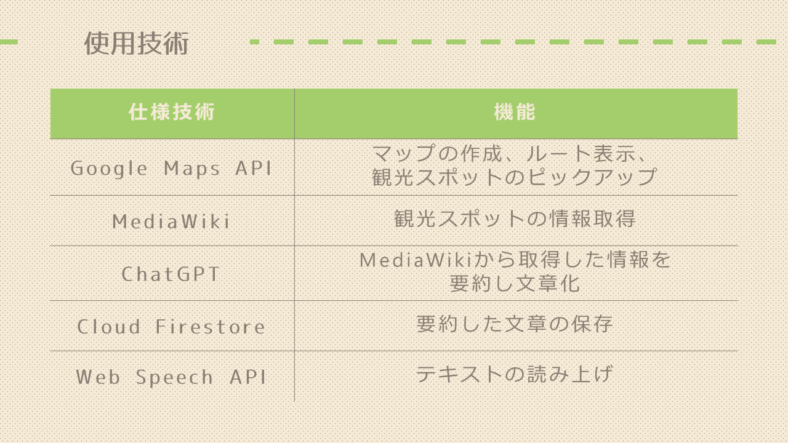

